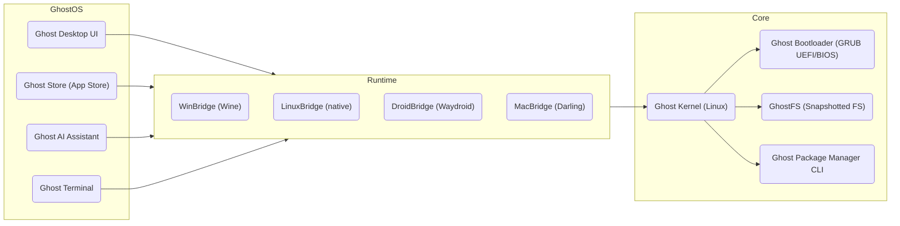

# GhostOS 2.0 — MVP Specification

**Executive Summary:** GhostOS is a modern, lightweight, AI-native operating system designed to run on low-end hardware while supporting applications from Windows, Linux, Android and the web in one unified platform. The 2.0 MVP focuses on a Linux-based kernel and core system, **USB bootable live/portable installer**, seamless **compatibility layers** (WinBridge, LinuxBridge, DroidBridge, MacBridge), and integrated **Ghost components** (desktop, store, AI, package manager, file system). This document defines the full MVP scope, architecture, features, development roadmap and repository plan for GhostOS 2.0.

 *Figure: Example GhostOS development environment with code editor and terminal (conceptual). GhostOS will include an integrated AI assistant to help with coding and system tasks.*

## Goals & Success Metrics

- **Universal App Support:** GhostOS can install and run apps from Windows (.exe/.msi), Linux (.deb/.rpm/AppImage), Android (.apk), and web (PWA) through unified commands.  
- **Performance:** Boot in < 5s on target hardware; run on 2GB RAM (2D UI) and 4GB RAM (full desktop) with < 10% idle CPU.  
- **Usability:** Modern UI with glassmorphism and fluent design; touch/keyboard friendly; accessible and localised.  
- **Stability & Security:** Each app sandboxed with strict permissions; reliable updates with atomic rollback.  
- **Portability:** Full “live USB” and “portable USB” modes; easy installation on SSD/HDD/USB with Secure Boot support.  
- **AI Integration:** On-device LLM assistant for coding, automation and user help.  
- **Community-Friendly:** Open-source licensing (GPL/MIT), clear governance, documentation, and contributor workflow.

**Success Metrics:** Functionally, success is measured by a release of GhostOS 2.0 with a working live USB ISO that can boot on diverse hardware and run sample Windows, Linux and Android apps, with the Ghost Store and AI assistant functional. Performance metrics (boot time, memory use) and usability benchmarks (startup apps, UI responsiveness) should meet targets. The MVP should have test coverage on major virtualization platforms (QEMU, VirtualBox, etc.) and at least one physical low-end device. Community adoption, GitHub contributions, and user feedback will gauge success.

## Scope

- **In-Scope:**  
  - **Kernel Base:** Forked Linux kernel (with modest patches) as GhostOS 2.0 kernel; `init` via systemd.  
  - **Live/USB Support:** ISO with GRUB (BIOS/UEFI, Secure Boot) for Live USB and installer.  
  - **Compatibility Layers:**  
    - **WinBridge:** Wine/Proton integration for .exe/.msi (directX translation as bonus).  
    - **LinuxBridge:** Native support for .deb/.rpm/AppImage/Flatpak/Snap.  
    - **DroidBridge:** Waydroid-like Android container for .apk (Android 13 image).  
    - **MacBridge:** Experimental support via Darling translation layer (basic Cocoa App support); advanced apps via future virtualization (post-MVP).  
  - **Ghost Components:** Desktop shell (Ghost Desktop), Ghost Store (package & app manager), Ghost AI (local LLM assistant), GhostFS (COW filesystem with snapshots), Ghost Package Manager (CLI tool, `.ghostpkg` format).  
  - **Driver Hub:** Auto-detection/installation scripts for GPU (Intel/AMD, OpenGL/Vulkan), Wi-Fi, etc.  
  - **Security:** App sandboxing (cgroups or Bubblewrap), SELinux/AppArmor policies, secure updater.  
  - **UX/UI:** English (en-GB) UI with WCAG accessibility, i18n support for common languages.  
  - **CI/CD:** GitHub Actions for build, test, and ISO pipeline; automated testing matrix (Ubuntu 22.04, Debian 12, Fedora 38, and Windows/Android containers).  

- **Out-of-Scope (2.0 MVP):**  
  - Native Ghost kernel (still Linux-based).  
  - Full Windows/macOS virtualization (Hyper-V or QEMU VM support only).  
  - Enterprise features (central management, analytics).  
  - Enterprise edition and large-scale device fleet tools.  
  - Deep Mac compatibility (full Metal/Swift support).  

## Architecture Overview

GhostOS has a layered architecture combining a Linux-based kernel with multiple compatibility and runtime layers. 



Key components:
- **Ghost Kernel (Linux)**: Custom distribution base (Linux 6.x), with filesystem drivers (ext4, Btrfs), cgroups for sandboxing, seccomp.
- **Systemd-based Init:** `systemd` runs as PID 1 with normal targets (graphical.target etc.), fast parallel service startup.
- **Ghost Bootloader:** GRUB2 supporting BIOS/UEFI/Secure Boot. Provides Live USB menu (Try GhostOS, Install, Recovery).  
- **Compatibility Layers:**  
  - *WinBridge* – integrates Wine/Proton to run many Windows apps. Wine “translates Windows API calls into POSIX calls on-the-fly”. We will package Wine within Ghost Runtime.  
  - *LinuxBridge* – native handling of Linux packages (APT, DNF, etc.). Ghost Package Manager abstracts these.  
  - *DroidBridge* – using Waydroid architecture to containerize Android. Supports ARM/x86 Android apps.  
  - *MacBridge* – via Darling for simple macOS apps; extended support via virtualization in later versions.
- **Ghost Store & Package Manager:** A unified app registry combining multiple ecosystems. Users type `ghost install <app>` and GhostOS selects the best format (native/package/wine/droid).  
- **Ghost AI:** On-device LLM (open weights like LLaMA/Mistral) with assistant that can generate code, manage packages, automate tasks, and provide voice interaction.  
- **GhostFS:** CoW filesystem (Btrfs/ZFS-like) with snapshots and rollbacks. Allows system restore and package rollback.  
- **Sandbox & Security:** Each app runs in isolated namespace (containers or seccomp-sandbox). Permission prompts (e.g. camera, files) are enforced globally. Updates and packages are signed for secure delivery.  

 *Figure: GhostAI concept illustration – GhostOS will include a local AI assistant for coding and system help (inspired by on-device AI frameworks).*

## Detailed Features

### Boot, Live USB & Installer
- **UEFI/BIOS Support:** GRUB2 for booting on modern UEFI and legacy BIOS machines. Supports GPT/MBR disks and Secure Boot (use signed bootloader or shim).  
- **Live Mode:** Boot GhostOS from USB (`ghostos.iso`). Runs in RAM with optional persistence overlay. Menu options: `Try GhostOS (Live)`, `Install GhostOS`, `Recovery Mode`, `Safe Mode`.  
- **Portable USB Mode:** Installer can target a USB or external drive, making GhostOS “portable” (apps and data live on USB). All settings and installations persist on the USB.  
- **Installer:** Guided GUI (and CLI) installer with language, keyboard, disk selection (auto-partitioning, LUKS encryption optional), user creation, and one-click install. Supports dual-boot setup if other OS detected.

### Kernel and Base System
- **Linux Kernel:** Start with latest LTS (e.g. 6.5+) as GhostOS kernel. Minimal patches for Ghost-specific features (e.g. sandbox modules).  
- **Init & Services:** `systemd` for init; includes DHCP, NetworkManager, logind, PulseAudio/pipewire for sound, Wayland compositor or X11 compatibility.  
- **Minimal Base:** Use Debian/Ubuntu base or buildroot-like approach. Essential daemons only to keep footprint small (target ISO size ~1–2 GB).  
- **Filesystem:** Root on ext4 or Btrfs. GhostFS snapshots leverages Btrfs or LVM snapshots.  
- **mkosi:** For building live images, use systemd’s mkosi tool to automate Debian/Ubuntu snapshots.

### Compatibility Layers

**WinBridge (Windows on GhostOS):**  
- Package Wine 7.x/8.x in the base. Provide `ghost run <app>.exe` which invokes Wine.  
- Integrate Proton’s DXVK for DirectX translations (for games) if GPU drivers present.  
- Map Windows paths to GhostOS FS.  
- *Citations:* Wine “lets you run Windows software on Linux”.

**LinuxBridge (Native Linux Apps):**  
- Support `.deb` and `.rpm` packaging via dpkg/apt and rpm/dnf.  
- Support AppImage, Flatpak, Snap: Ghost Store can fetch these.  
- CLI: `ghost install <app>` chooses the distro-native package; fallback to Snap/AppImage if needed.  
- Ensure GNOME/KDE themes for cross DE app consistency.

**DroidBridge (Android on GhostOS):**  
- Container-based Android (like Waydroid). Provide `ghost install <app>.apk`.  
- Use a LineageOS-based image (Android 13).  
- Expose hardware (GPU, audio, sensors) through Binder and Wayland integration.  
- Windowed multi-tasking support via Waydroid’s multi-window mode.

**MacBridge (macOS on GhostOS):**  
- *MVP 2.0:* Include Darling translation layer for basic macOS CLI/GUIs (mostly X11-based apps).  
- User can `ghost install <app>.dmg`, and GhostOS will attempt to use MacBridge to run it.  
- Full GUI Mac apps support is *experimental*. Document known limitations (no Metal, incomplete AppKit).  
- Future: Expand MacBridge via virtualization if feasible.

### Ghost Package Format & Store
- **Ghost Package (.ghostpkg):** A zip-like archive with:  
  ```json
  {
    "name": "ExampleApp",
    "version": "1.0.2",
    "type": "app",
    "exec": "bin/example",
    "arch": "x86_64",
    "description": "Example application for GhostOS",
    "permissions": {
      "filesystem": ["~/Documents/ExampleApp"],
      "network": ["allow"],
      "camera": ["deny"]
    }
  }
  ```
- Contains binaries/, assets/, manifest.json, signature.  
- **Ghost Store:** A unified repository service (web and CLI). Host curated Ghost packages + links to Linux Distro repos + Android APK repos + Wine/Proton metadata.  
- CLI Example: 
  ```bash
  ghost install code
  ghost install discord
  ghost update all
  ghost remove app.name
  ```
- Auto-update via `ghost update`, with rollback on failure.

### Ghost AI Assistant
- **Local LLM:** Integrate an open-source LLM (e.g. Mistral, LLaMA) running on-device. Optionally use GPU/NPU acceleration if available.  
- **Capabilities:** Code generation (via Ghost Terminal: `ghost ai explain code.py`), system diagnostics, natural language commands (`hey ghost, update packages`).  
- **Voice & Chat UI:** Headless and graphical chat widget. Offline operation (no cloud calls by default).  
- **Integration:** AI can assist in app installation, debugging, translations, document search, and guiding through UI flows.

### GhostFS (Filesystem)
- **Copy-on-Write FS:** Based on Btrfs or LVM+EXT4 with snapshots.  
- **Features:**  
  - Instant system snapshots (pre-update snapshot).  
  - Rollback: `ghostfs rollback last` to revert to last snapshot.  
  - Compression and encryption (via Btrfs native or LUKS for root).  
  - Fast metadata search (files, applications).  

### Security & Sandboxing
- **Sandboxing:** Each application runs confined (optionally using Bubblewrap or containers). e.g. Flatpak-style sandbox for Linux apps, Wine prefixes for Windows apps.  
- **Permissions:** User grants per-app permissions (Files, Network, Camera, etc.). Example UI:
  ```
  Telegram: Files✔, Network✔, Camera✗, Microphone✗, Location✗
  ```
- **Updates:** All packages/app updates are signed. Use OSTree-style atomic updates or SmartOS-like updated. Supports rollback on bad updates.  
- **Lockdown Mode:** Optionally disable external networks or mount points for high-security use.

### Drivers & Hardware Support
- **Automatic Detection:** On first boot, GhostOS detects hardware and suggests/install drivers.  
- **GPU:** Ship open-source Mesa/Intel/AMD drivers out of box. NVIDIA via additional repo (optional install).  
- **Driver Hub:** GUI/CLI tool to fetch latest proprietary drivers (NVIDIA, Wi-Fi firmware, Bluetooth) based on hardware IDs.  
- **Multiplatform:** Support x86_64; initial ARM64 support for ARM PCs (Android via DroidBridge also on ARM).

### Update System & CI/CD
- **Updates:**  
  - Monthly security updates (like Ubuntu LTS cadence).  
  - `ghost update` pulls from official GhostOS repos or auto-switch between distro mirrors.  
  - Rolling vs Fixed: 2.0 MVP is semi-rolling (base moves slowly; apps can be on-demand).  
- **CI/CD:**  
  - GitHub Actions pipeline: build Ghost components (Rust/Cargo for runtime, Flutter for UI, etc.), run unit tests, build ISO.  
  - Example workflow:
    ```yaml
    name: GhostOS CI
    on: [push, pull_request]
    jobs:
      build:
        runs-on: ubuntu-latest
        steps:
          - uses: actions/checkout@v3
          - name: Set up Rust
            uses: actions-rs/toolchain@v1
            with: {toolchain: stable}
          - run: cargo build --workspace --release
          - run: ./scripts/build-iso.sh  # builds ghostos.iso
      test:
        ...
      release:
        ...
    ```
  - **Testing Matrix:** Build/test on Ubuntu 22.04, Debian 12, Fedora 38. QEMU VM test boots. Windows host build for cross-compatibility.

### Hardware Targets
- **Minimum:** Dual-core CPU, 2GB RAM, 16GB storage. (2D UI only).  
- **Recommended:** Quad-core CPU, 4GB+ RAM, 64GB SSD. GPU acceleration recommended (Intel/AMD).  
- **Live Mode:** Runs with as low as 1GB for basic CLI Live session.  

### UX/UI Guidelines
- **Design System:** Glassmorphism + Fluent/Material 3.  
- **Layout:** Top bar (system controls, AI, Search), left Smart Dock (apps/folders), central workspace.  
- **Themes:** Light, Dark, auto. Accent colour (Ghost Cyan).  
- **Mockups:** See [Figure Embedded]. GhostUI framework (Flutter or Rust+WebGPU) for custom apps.  

 *Figure: Example GhostOS code editor (conceptual). Ghost Desktop will feature a clean, distraction-free interface with fluent UI elements.*

### Accessibility & Internationalisation
- **Accessibility:** Keyboard navigation, high-contrast themes, screen reader support. Follow WCAG guidelines for UI elements.  
- **Localization:** i18n support in UI and installer. Target languages: en-GB (default), bn, zh, es, fr, ar, etc.  
- Use gettext or FTL for strings; community can contribute translations.

### Licensing & Governance
- **Licenses:** GhostOS core (kernel, runtime, UI) under permissive (MIT/Apache) or GPLv3 (for Linux/Darling). Components like GhostFS or Tools under MIT.  
- **Open Source:** Code on GitHub. Encourages community contributions, issues and PRs. Documentation hosted in repo/docs/ (use MkDocs).  
- **Governance:** Project governed by meritocratic model. Steering Group of core maintainers. Code of Conduct and Contributor Guidelines in place.  

### Community & Ecosystem
- **Community:** Public forums/Discourse, Matrix/IRC, GitHub Discussions for support.  
- **Packages:** Packaging guidelines for maintainers. Mirror of popular GitHub releases for apps.  
- **Developer Platform:** GhostSDK for app development (Rust/C++, Flutter, Web). GitHub Templates for new Ghost apps.  

## Team Roles & Timeline

**Key Roles (Open Requirements):**

| Role                  | Responsibilities                                                          |
|-----------------------|---------------------------------------------------------------------------|
| **Project Lead**      | Overall architecture, direction, releases, stakeholder communication.     |
| **Kernel Engineer**   | Manage Linux kernel config/patches, driver support, bootloader.          |
| **System Engineer**   | Build ISO tools (mkosi/xorriso), systemd init config, live USB setup.    |
| **Runtime Engineer**  | Implement Ghost runtime (Rust), compatibility layers (Wine/Darling).     |
| **Desktop Engineer**  | Develop Ghost Desktop (UI frameworks, GTK/Flutter), theme design.        |
| **AI Engineer**       | Integrate LLM, AI assistant UI, machine learning tooling.                |
| **Package Manager Engineer** | Ghost Store backend (Rust or PHP/Laravel), CLI tools, ghostpkg format. |
| **QA Engineer**       | Testing frameworks, automated tests, hardware QA.                        |
| **Docs/Community**    | Documentation (Markdown), tutorials, community outreach, localization.   |

**Development Roadmap & Milestones:** Targeting a **6–12 month** timeline for GhostOS 2.0 MVP, following agile sprints. The following milestones (date ranges indicative):

```mermaid
gantt
    title GhostOS 2.0 Development Timeline
    dateFormat  YYYY-MM-DD
    section Foundation
    Kernel & Tools Setup     :done,    k1, 2026-07-01, 2m
    subgraph 2026 Q3-Q4
    Desktop Alpha            :done,    d1, after k1, 3m
    Compatibility Setup      :active,  c1, after d1, 3m
    Ghost Store & Packaging  :         s1, after c1, 2m
    end
    section 2027 Q1-Q2
    AI Assistant Integration :         ai1, 2027-01-01, 3m
    USB/Installer Final       :         i1, 2027-04-01, 2m
    Final Testing & Polish    :         t1, 2027-06-01, 1m
    section Release
    GhostOS 2.0 Beta         :         beta1, after t1, 1d
    GhostOS 2.0 RC/Stable    :         rel1, 2027-07-01, 1d
```

- **Milestones Table:**

| Milestone           | Date (ETA)     | Description                                                 |
|---------------------|----------------|-------------------------------------------------------------|
| **Kernel & Base**   | Jul–Aug 2026   | Fork base distro; init system; basic services (network).    |
| **Desktop UI Alpha**| Oct 2026       | Basic Ghost Desktop with dock, window management, themes.   |
| **Compat Alpha**    | Nov 2026       | Wine and Waydroid containers functional with sample apps.  |
| **Ghost Store Alpha**| Dec 2026      | CLI `ghost install` working for at least one app type.     |
| **AI Alpha**        | Mar 2027       | Local LLM integrated; basic assistant queries.              |
| **Installer & ISO** | Jun 2027       | Working live USB ISO; GUI installer completed.             |
| **2.0 Beta**        | Jul 2027       | Feature-complete beta; documentation ready.                |
| **2.0 Release**     | Aug 2027       | Public stable release; project handover to community.       |

**Budget Estimates (rough):**  
- *MVP (team, infrastructure):* ~£50–100k (first year dev).  
- *Full 2.0 Product:* ~£300–500k (2–3 years, additional hires).  
- *Community & Org Costs:* +£50k/year (hosting, events, etc.).  

## GitHub Repository Audit

### Suggested Project Structure

```
ghostos/ (monorepo)
├── .github/
│   ├── workflows/ci.yml
│   ├── ISSUE_TEMPLATE.md
│   └── PULL_REQUEST_TEMPLATE.md
├── kernel/                # Kernel configs/patches
├── system/                # initramfs, init scripts
├── desktop/               # Ghost Desktop UI (e.g. Flutter or Qt)
├── runtime/               # Ghost runtime (Rust) & compat layers
├── store/                 # Ghost Store backend (Laravel/PHP or Rust)
├── ai/                    # AI assistant integration & models
├── pkgmgr/                # Ghost Package Manager CLI (Rust)
├── fs/                    # GhostFS tools (snapshot/rollback)
├── tools/                 # Build scripts (Dockerfiles, ISO builder)
├── docs/                  # Specification & user docs (Markdown)
└── LICENSE README.md etc.
```

### Files & Modules to Add/Update

- **README.md:** Comprehensive overview (this doc).  
- **LICENSE:** GPLv3 or MIT as chosen.  
- **.github/**:  
  - *Workflows:* `ci.yml` for building and testing, `release.yml` for ISO creation.  
  - *Templates:* ISSUE_TEMPLATE.md (bug/feature requests), PULL_REQUEST_TEMPLATE.md (commit guidelines).  
- **docs/**:  
  - `CONTRIBUTING.md`, `CODE_OF_CONDUCT.md`, and architecture/feature docs in Markdown.  
  - `CHANGELOG.md` to log each release (semantic versioning).  
- **kernel/**: Configs and patch files (e.g. ghostos-kernel.config, patch-dm-settings, patch-hypervisor).  
- **desktop/**:  
  - If Flutter: `pubspec.yaml`, Flutter project files.  
  - UI assets, icons, styles (Ghost theme JSON).  
- **runtime/**: Cargo workspace with crates: `ghost_runtime`, `wine-integration`, `waydroid-integration`, `darling-wrapper`.  
- **store/**: e.g. Laravel or Rust rocket project. Includes `composer.json` or `Cargo.toml`, API endpoints for listing/installing apps.  
- **pkgmgr/**: CLI tool in Rust/Python (`Cargo.toml` or `pyproject.toml`).  
- **ai/**: LLM config files, possible Python scripts for integration.  
- **fs/**: Snapshot scripts (`ghost-snapshot`), `GhostFS` service.  
- **tools/**:  
  - `Dockerfile.build` for reproducible environment.  
  - `build-iso.sh` or Makefile invoking mkosi/xorriso.  
  - `release.sh` to publish ISO to GitHub Releases.  

### CI/CD & Build Scripts

- **CI Workflow (e.g. .github/workflows/ci.yml):**  
  - Triggers on push/pull to `main`.  
  - Steps: checkout, set up Rust, Node/Flutter, PHP.  
  - Compile all modules (`cargo build --release`, `npm run build`, `php artisan migrate`).  
  - Run tests (`cargo test`, `npm test`).  
- **ISO Builder:**  
  - Use `mkosi` (systemd) or `live-build`. Example `mkosi.yaml` config.  
  - `build-iso.sh` might run:
    ```bash
    mkosi --image-format iso --arch amd64 --default noarch \
      --doverlay desktop,target=default \
      ghostos
    ```
  - Or manual steps: generate chroot, install packages, configure init, GRUB, then `xorriso -as mkisofs ... -o ghostos.iso`.  
  - *Mermaid Note:* (see [mkosi docs for automating custom OS images).

- **Dockerfile (Example for building GhostOS image):**  
  ```dockerfile
  FROM ubuntu:22.04
  RUN apt-get update && apt-get install -y git curl build-essential \
      wget xorriso grub-pc-bin mtools qemu-utils
  WORKDIR /build
  COPY . .
  RUN ./tools/build-iso.sh
  ```

### Documentation & README

- **README.md:** Overview, quick start (how to boot ISO, report issues).  
- **Developer Docs:** Under `docs/` with mkdocs or similar, covering architecture (this MVP spec), coding guidelines, API references.  
- **Samples:** Include example `manifest.json` for `.ghostpkg`, e.g.: 
  ```json
  {
    "name": "vscode",
    "version": "1.2.3",
    "exec": "/usr/bin/code",
    "type": "app",
    "arch": "x86_64",
    "dependencies": ["libgtk-3-0", "libgnome-keyring0"]
  }
  ```
- **Package Manifests:**  
  - *Cargo.toml* (Rust) example:
    ```toml
    [package]
    name = "ghost_runtime"
    version = "0.1.0"
    edition = "2021"
    authors = ["GhostOS Devs"]
    ```
  - *package.json* (if Node/React UI) example:
    ```json
    {
      "name": "ghost-desktop",
      "version": "0.1.0",
      "scripts": {
        "start": "electron .",
        "build": "electron-builder"
      },
      "dependencies": {
        "electron": "^25.0.0",
        "react": "^18.0.0"
      }
    }
    ```
- **Changelog:** Follow [Keep a Changelog](https://keepachangelog.com/) format.

### Prioritized Issues / PRs

| Issue / PR                           | Type       | Priority | Suggestion / Commit Message                      |
|--------------------------------------|------------|----------|--------------------------------------------------|
| Setup GitHub Actions CI pipeline     | CI         | High     | *chore*: add CI workflow for build and tests     |
| Define Ghost package manifest schema | Spec       | High     | *feat*: add ghostpkg manifest JSON schema        |
| Implement basic `ghost install` CLI  | Feature    | High     | *feat*: initial Ghost Package Manager CLI in Rust|
| Create Ghost Store prototype         | Feature    | High     | *feat*: scaffold Ghost Store (Laravel or Rust)   |
| Design GhostFS snapshot tool         | Feature    | Medium   | *feat*: add GhostFS snapshot/rollback scripts    |
| Integrate Wine for Windows support   | Feature    | High     | *chore*: include Wine in runtime; test .exe apps |
| Integrate Waydroid (Android)         | Feature    | Medium   | *chore*: set up Waydroid container in runtime    |
| Add Darling (macOS) experiment       | Research   | Low      | *feat*: add Darling library support (MacBridge)  |
| Develop Ghost Desktop UI prototype   | Feature    | High     | *feat*: initial Ghost Desktop UI scaffold (Flutter)|
| Document dev environment setup       | Docs       | High     | *docs*: write setup guide (deps, Docker, mkosi)  |
| Create ISO build scripts             | CI/CD      | High     | *feat*: add `build-iso.sh` and Dockerfile        |
| Accessibility audit                  | Quality    | Medium   | *chore*: review UI for WCAG compliance           |
| Localization scaffolding             | Feature    | Medium   | *feat*: add i18n support and sample locales      |

For each issue, link a corresponding branch/PR when implemented. Example commit messages are shown above. 

## Summary

GhostOS 2.0 will be a **USB-bootable, AI-enhanced, lightweight operating system** unifying multiple ecosystems. This MVP spec and roadmap provide a developer-ready blueprint: from low-level kernel choices through high-level store and AI components, including all necessary build and CI configurations. The repository should be updated with the structures, scripts, and documentation outlined above. Community contributions can follow this plan to implement GhostOS 2.0 step-by-step, starting with the high-priority CI and runtime features. 

Our approach balances **pragmatism and ambition**: leveraging existing open-source (Linux, Wine, Waydroid, Darling) while building Ghost-specific features (store, package manager, AI assistant). The result will be a cohesive, modern OS platform meeting the vision: “One OS, every app, any device.” 

