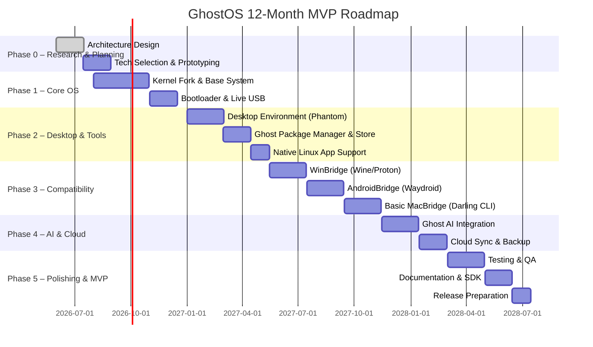

# GhostOS MVP Specification

**One OS, Every App, Any Device.** GhostOS is a next-generation lightweight operating system with a modern AI-native desktop.  It unifies Windows, Linux, Android (and web) applications on low-end hardware, while providing a secure sandboxed environment. This document defines a complete production-ready MVP specification: goals, requirements, architecture, modules, packaging, security, testing, roadmap, team, and deliverables. All information is sourced from official documentation where applicable.

## Overview

GhostOS is built on an initially Linux-based kernel (codenamed *ghost Kernel*) and includes:

- **Compatibility Layers:** Run Windows apps via Wine/Proton, Android apps via Waydroid, Linux native apps, and (future) Mac apps via Darwin translation (Darling).
- **Universal Package Management:** A custom `.ghostpkg` format and store that installs and updates applications across formats (.exe, .msi, .dmg, .deb, .rpm, .AppImage, .apk, PWAs, containers) from one repository.
- **Modern Desktop Environment:** *Phantom Desktop* with a glassmorphic, 120Hz-animated UI built on Flutter or a similar cross-platform UI framework.
- **AI Core:** Built-in local AI assistant (coding help, voice commands, system automation, etc.), using local LLMs.
- **USB Boot & Live Modes:** Bootable USB (UEFI & BIOS, Secure Boot) supporting live session, persistence, and full installation.
- **Security Sandbox:** Every app runs in an isolated sandbox (namespaces, seccomp, AppArmor/Cgroups, or container) with fine-grained permissions, and the OS supports atomic signed updates with rollback.
- **Portable OS:** Optional full installation on USB for “carry-your-OS” portability.

GhostOS’s goal is a robust cross-platform experience on minimal hardware (e.g. 2 GB RAM, dual-core CPU).  It prioritizes performance and battery life, with GPU-accelerated UI and minimal background overhead. 

**Key sources:** WineHQ explains Windows compatibility on Linux; Waydroid docs describe running Android in a Linux container; Darling showcases efforts for macOS compatibility.  For security, Ubuntu docs note that UEFI Secure Boot ensures only signed boot binaries run.  GhostOS builds on these proven technologies.

## Goals & Objectives

- **Universal Application Support:** Enable installing and running Windows, Linux, Android, and web apps from a single unified system. (e.g. `ghost install vscode`, `ghost install telegram`).
- **Lightweight & High Performance:** Target minimal specs (2 GB RAM, 16 GB disk, dual-core CPU), fast boot (<5 s cold), and smooth 120 Hz UI animations.  
- **Modern UI/UX:** Glassmorphism, responsive design for desktop/tablet, dark/light modes, multi-touch, and fast animations.  
- **AI-Native:** Integrate an offline-capable AI assistant for code help, voice commands, system management, and smart search.  
- **Secure by Design:** App sandboxing, least-privilege permissions, signed updates, encryption by default (disk and memory).  
- **USB Portability:** Support live-USB sessions with persistence, and full “portable OS” installs on external drives.  
- **Open Ecosystem:** Core OS is open-source (Linux kernel fork), with an open platform for third-party developers, SDK, and APIs.  

## Non-Functional Requirements

- **Performance Targets:** Cold boot in <5 s on SSD, <10 s on HDD (with UEFI Fast Boot). Typical app launch under 1 s. Idle memory footprint <300 MB (desktop only) on minimal config. UI should target 60–120 Hz refresh (GPU-accelerated via OpenGL/Vulkan).  
- **Hardware Support:** 
  - **CPU:** 64-bit x86 (Intel/AMD) with SSE2+, and optional support for ARM64 (future).  
  - **GPU:** Support for integrated Intel/AMD and discrete GPUs via Mesa/Vulkan; DXVK to translate DirectX; basic NVIDIA support via open drivers (Nouveau).  
  - **Storage:** MBR/GPT, BIOS/UEFI firmware (x86), Secure Boot (shim/GRUB with signed binaries).  
  - **Peripherals:** Graphics, audio (ALSA/PipeWire), networking (Ethernet/Wi-Fi), USB, Bluetooth, etc. Automatic driver installation via built-in *Driver Hub*.  
- **Resource Constraints:**  
  - *Minimum Target:* Dual-core CPU, 2 GB RAM, 16 GB storage.  
  - *Recommended:* Quad-core, 4 GB+ RAM, 64 GB SSD.  
- **Security & Reliability:**  
  - **Secure Boot:** Use a Microsoft-signed shim loader and signed GRUB/kernel (per Ubuntu Secure Boot model).  
  - **Isolation:** Use Linux namespaces or containers for app sandboxes (like Flatpak/Snap).  
  - **Updates:** Transactional (atomic) updates with snapshot/rollback (modeled on openSUSE transactional-update).  
  - **Permissions:** POSIX ACLs, AppArmor profiles, and user-consent permission dialogs (like Android’s).  
  - **Data Protection:** Full disk encryption (LUKS) optional; filesystem snapshots and system rollback.  

## Supported Application Formats

GhostOS will support these formats:

- **Windows:** `.exe` and `.msi` installers via **WinBridge** (Wine/Proton compatibility layer).  
- **macOS:** `.app` bundles and `.dmg` disks via **MacBridge** (Darling translation layer) – initially limited to simple tools (full Cocoa/Metal apps are long-term goals).  
- **Linux:** Native Linux packages (`.deb`, `.rpm`), self-contained `.AppImage`, Flatpak, and Snap (via container runtime).  
- **Android:** `.apk` / `.aab` via **AndroidBridge** (Waydroid/Android Runtime).  
- **Web:** Progressive Web Apps (PWAs) via Chromium-based browser integration.  
- **Containers:** Docker/OCI images via a built-in container engine (e.g. Podman or containerd).  

Supported sources include official vendor sites, GitHub releases, and GhostOS Store repositories.  The Ghost Store UI and CLI (`ghost install <app>`) will automatically fetch and install the optimal format (preferring native packages, otherwise container or compatibility).

## macOS Compatibility Plan

**Current limitations:** Native macOS binaries rely on Cocoa, CoreFoundation, Metal, etc., which are absent on Linux. Darling (macOS translation layer) is still experimental and primarily supports CLI and very simple GUI apps.  As such, GhostOS 1.x will **not** guarantee full `.app` compatibility. The installer can *extract* `.dmg` archives but not automatically install Mac apps.

**Plan:**  
1. **MVP (GhostOS 1.0):** No native Mac app support; treat `.dmg/.pkg` as just archives. Focus on Windows, Linux, Android.  
2. **GhostOS 2.0:** Introduce **MacBridge** with basic support: allow launching lightweight CLI tools and possibly a subset of GUI apps via Darling (leveraging the Linux kernel fork’s translation of Mach/Darwin calls). Likely restricted to open-source/light apps (e.g. Mac homebrew utilities).  
3. **GhostOS 3.0+:** Improve MacBridge to support popular apps. Possibly containerize macOS (Hackintosh-style VM with Hypervisor.framework translation) or advanced translation. Target apps: VS Code (mac build), Sublime, Figma, Notion, etc. 

Throughout, GhostOS will automatically prefer non-Mac alternatives from its store (e.g. install Linux or Windows builds if available) to minimize reliance on MacBridge.

## USB Bootable, Live, and Portable Modes

GhostOS must boot from USB in multiple modes:

- **UEFI & BIOS:** Support both firmware types, with Secure Boot (shim+GRUB signed). Use GPT partitioning (fallback to MBR for BIOS).  
- **Live USB Mode:** A read-only compressed SquashFS root with an overlayFS rw layer in RAM or USB. On boot, offer “Try GhostOS” (RAM-mode live) and “Install GhostOS”. Enable *persistent storage* partition for user data (like Debian/Ubuntu live USBs).  
- **Portable USB Mode:** The user can install GhostOS *onto* a USB drive, making it a fully persistent OS. All apps, settings, and data reside on the USB. The USB should be optimized (e.g. using ext4 or GhostFS) and possibly include an EFI bootloader for portability.  
- **Full Installation:** Optionally install GhostOS to internal SSD/HDD/NVMe or external SSD (with proper bootloader setup). Support dual-boot alongside Windows/Mac.  
- **PXE/Network Boot (Optional):** Support netboot environments for enterprise deployment.

**Bootloader:** Use GRUB or systemd-boot as the primary bootloader. Secure Boot will be managed via a signed shim that loads the GhostOS kernel. The installer pipeline (e.g. using Debian live-build or SUSE KIWI) will generate an ISO with embedded bootloader, kernel, initramfs, etc.

```bash
# Example: make a bootable GhostOS USB (conceptual)
# Assumes ghostos.iso downloaded
sudo dd if=ghostos.iso of=/dev/sdX bs=4M status=progress
```

*Sources:* The Ubuntu Secure Boot docs explain using a shim and signed kernels to boot. The Kali documentation details making live USBs with persistence via overlay partitions, which GhostOS can emulate.

## Architecture Overview

```mermaid
flowchart TB
  subgraph GhostOS System
    A[Ghost Bootloader (UEFI/BIOS)]
    B[ghost Kernel (Linux-based)]
    C[Ghost Desktop (UI/Window Manager)]
    D[Compatibility Layer Engine]
    E[Ghost Store & Package Manager]
    F[Ghost AI Assistant/Core]
    G[Security Sandbox & Firewall]
    H[GhostFS / Storage]
    I[Driver Hub]
    A --> B
    B --> C
    B --> D
    B --> E
    B --> F
    B --> G
    B --> I
    C --> E
    D --> J[WinBridge (Wine/Proton)]
    D --> K[MacBridge (Darling)]
    D --> L[AndroidBridge (Waydroid)]
    D --> M[LinuxBridge (Native)]
    J --> JApp[.exe/.msi Apps]
    K --> KApp[.app/.dmg Apps]
    L --> LApp[.apk/.aab Apps]
    M --> MApp[.deb/.rpm/.AppImage Apps]
    F --> AIModel[(Local LLM, NPU)]
    H --> Snapshots[(Snapshots, Compression, Encryption)]
    E --> Repo[Ghost Repo (OSS & Enterprise)]
  end
```

**Components:**

- **ghost Kernel:** A Linux kernel fork with possible custom scheduler and security modules. Handles hardware, drivers, process scheduling, and system calls.
- **Ghost Bootloader:** GRUB-based (UEFI/BIOS) with secure boot (shim). Loads kernel/initramfs.
- **Compatibility Layer:** A service that launches foreign apps in translation:
  - *WinBridge (Wine/Proton)* – translates Windows API to POSIX.  
  - *MacBridge (Darling)* – provides a Darwin/macOS environment.  
  - *AndroidBridge (Waydroid)* – runs Android in a container using Linux namespaces.  
  - *LinuxBridge* – native execution for Linux binaries.
- **Ghost Desktop Environment:** UI shell (Phantom Desktop) with top panel (search, AI, status), dock, workspaces, notifications, and a widget system.
- **Ghost Store & Package Manager:** CLI (`ghost`) and GUI store for installing/updating apps. Manages .ghostpkg and pulls from multi-format repo.
- **Ghost AI Core:** Local AI/LLM for assistant tasks (could use open-source models).
- **Security Sandbox:** Container or namespace-based sandbox for each app (akin to Flatpak). Controls permissions (file access, network, devices).
- **GhostFS:** A Union/Btrfs-based filesystem with compression, encryption, and snapshot support.
- **Driver Hub:** Auto-detects hardware and fetches proprietary drivers if needed (e.g. GPU drivers).
- **Update System:** Ensures atomic system updates. Likely uses snapshots (e.g. Btrfs) and a transactional update mechanism.

## Module Breakdown

### Kernel & Core System

- **Linux Kernel (ghost):** Initial base from a recent stable Linux. Customization includes integrating Rust components, real-time scheduling (if needed), and added sandbox hooks (seccomp filtering).  
- **Init & Services:** Use `systemd` or `s6` for init. Handles service startup and user sessions.

### Compatibility Engine

- **WinBridge:** Incorporates Wine (or Proton from Valve) to launch Windows `.exe` apps. Example: `wine /path/to/app.exe` under the hood. Steam (Proton) integration for games.  
- **AndroidBridge:** Uses Waydroid (an Android container) to run APKs with near-native performance.  
- **MacBridge:** Uses Darling to provide a Darwin environment on Linux. Initially CLI-only, with future GUI support.  
- **LinuxBridge:** Native support (no translation) for ELF binaries (`.deb`, `.rpm`, `.AppImage`).  

### Desktop Environment

- **UI Framework:** Likely Flutter (Google’s UI toolkit) or Qt for GPU-accelerated interfaces.  
- **Features:** Virtual desktops, smart dock, global search (indexed files/apps), notification centre, system settings.  
- **Theme Engine:** Light/Dark modes, customizable accent colors (e.g. “Ghost Cyan”), animation manager (120 Hz).

### Ghost Store & Package Manager

- **Ghost CLI:** `ghost install <app>`, `ghost remove`, `ghost update`, `ghost snapshot`, etc.  
- **Repo:** A unified repo containing `.ghostpkg` metadata that links to Windows EXEs, Linux packages, Android APKs, or container images.  
- **Installer Integration:** GUI Store for browsing apps (with screenshots, ratings). Enterprise repo support.

**Package Formats:** `.ghostpkg` (custom archive containing binaries for each platform, manifests, scripts, and cryptographic signature).   Example manifest (`manifest.json`):

```json
{
  "name": "example-app",
  "version": "1.2.3",
  "maintainer": "Vendor Name",
  "description": "A cross-platform example application.",
  "platforms": {
    "windows": { "path": "bin/windows/example.exe", "sha256": "abc123..." },
    "mac":     { "path": "bin/macos/example.app.tar.gz", "sha256": "def456..." },
    "linux":   { "path": "bin/linux/example.AppImage", "sha256": "789abc..." },
    "android": { "path": "bin/android/example.apk", "sha256": "012def..." }
  },
  "dependencies": [
    { "name": "libfoo", "version": ">=1.0" }
  ],
  "postinstall": "scripts/postinstall.sh",
  "permissions": {
    "network": true,
    "camera": false,
    "files": ["~/Documents/example"]
  }
}
```

The `ghostpkg` bundle (`example-app.ghostpkg`) includes the above manifest, all binaries, optional assets, scripts, and a `signature.sig` file. The Ghost Package Manager reads this to install apps and enforce permissions.

### GhostFS (File System)

- **Snapshotting:** Based on Btrfs or ZFS (userland) to enable fast snapshots and rollbacks (like openSUSE’s approach).  
- **Overlay Support:** Live-USB persistence uses overlayFS on top of read-only SquashFS.  
- **Encryption:** On-disk encryption (LUKS or native FS encryption) for privacy.  
- **Compression:** Transparent compression to save space.  
- **Fast Search:** Indexing (like `tracker` or `recoll`) for global search of files.

### Sandboxing & Security

- **Sandboxing:** Use Linux namespaces (unshare, bubblewrap) to isolate each app’s process. Similar to Flatpak’s sandbox model or Chrome’s site isolation.  
- **Permissions:** Implement a permission system (inspired by Android/Flatpak portals) so apps must request access to camera, microphone, files, etc. E.g. a Telegram app shows “X permissions granted/denied” before install/run.  
- **Signed Binaries:** All system packages, kernel modules, and updates are signed. Secure Boot ensures only signed kernel. App packages are signed by vendors or GhostOS keys.  
- **Firewall:** Built-in firewall (nftables/iptables) per-container if needed.  
- **Least Privilege:** By default, apps have minimal rights; escalate only with user consent.

### Update System

- **Atomic Updates:** Using a mechanism like openSUSE's transactional-update. Create a snapshot of the system tree, apply updates (e.g. package installs) in it, then commit or rollback.  
- **Delta/Compressed Packages:** To save bandwidth, use binary deltas or zsync for ISO updates.  
- **Rollback:** On boot failure or user request, roll back to previous snapshot.  
- **Channels:** Support stable and rolling releases; users can opt into an enterprise channel for critical updates.

## Installer and ISO Build Pipeline

- **ISO Build:** Use Debian Live-Build or SUSE KIWI to generate a GhostOS ISO with all components. The ISO contains a GRUB EFI image, Linux kernel, initramfs, and live system.  
- **Live USB Creation:** Recommend tools like Ventoy or balenaEtcher to copy the ISO to USB. The ISO will support persistent overlay.  
- **Installer:** The live session includes an installer (e.g. Calamares or a custom one) with steps: language, keyboard, disk partition (with auto-partition option), user account, encryption, and install. The installer will set up GRUB boot on target.  
- **Continuous Integration:** The build pipeline is automated (CI/CD) using tools like Packer, Jenkins/GitHub Actions to produce nightly/weekly builds. Each build runs automated tests (see Testing Plan).  
- **Driver Repository:** The Installer fetches drivers (e.g. NVIDIA/AMD) via a curated repo if needed after first boot.

## Testing Plan

A robust testing strategy is crucial:

- **Hardware Matrix:** Test on representative hardware sets:
  - **CPUs:** Intel/AMD x86-64 (SSE2+), optionally ARM64.  
  - **GPUs:** Intel iGPUs, AMD Radeon, NVIDIA (Proprietary & Nouveau).  
  - **Peripherals:** Wi-Fi chipsets, Bluetooth, audio codecs, printers, webcams.  
  - **Devices:** Laptops, desktops, tablets (touchscreens).  
- **Installation Tests:** Use openQA (openSUSE’s test framework) to automate full installation testing. It can boot ISO in QEMU with various options and verify UI output.  
- **App Compatibility Tests:** Create test scripts that install and run popular apps:
  - **Windows apps:** e.g. Notepad++, 7-Zip via Wine.  
  - **Linux apps:** e.g. `apt install firefox`, running native software.  
  - **Android apps:** e.g. installing an Android game in Waydroid.  
- **Stress & Performance:** Benchmark with glxgears, video decode, and measure idle/running power.  
- **Security Tests:** Run SELinux/AppArmor policies through audit, attempt sandbox escapes.  
- **Continuous Integration:** 
  - **Unit Tests:** For Ghost tools (pkg manager, store, sandbox) using mocked environments.  
  - **Integration Tests:** Each commit triggers building an ISO and running smoke tests in QEMU.  
  - **Fuzzing:** Use tools like AFL/QEMU to fuzz system calls and compatibility layers.  

_Citation:_ “openQA is an automated test tool that makes it possible to test the whole installation process… It uses virtual machines to reproduce the process, check the output at every step, and send necessary keystrokes.” GhostOS will adopt openQA to validate ISO boots, installers, and basic functionality on each build.

## Roadmap & Milestones



- **Phase 0 (3–6 months):** Research, define architecture, build prototypes of Win/Android bridges.  
- **Phase 1 (6–9 months):** Linux-base OS core, bootloader, installer, USB live.  
- **Phase 2 (9–12 months):** Desktop UI (Flutter), package manager & store, native Linux app ecosystem.  
- **Phase 3 (12–18 months):** Compatibility layers: Windows (Wine/Proton), Android (Waydroid), initial Mac support, container isolation.  
- **Phase 4 (18–24 months):** Integrate AI assistant, cloud sync services, enterprise features.  
- **Phase 5 (24+ months):** Long-term: custom kernel components, advanced Mac support, enterprise tooling.

Milestones:
- **MVP Release (~18 months):** GhostOS-1.0 stable ISO with USB boot, core desktop, store, Windows/Android app support, AI assistant.
- **GhostOS 2.0 (~24 months):** Improved compatibility (faster Wine, add APK performance, initial Mac GUI), GhostSDK, enterprise deployment suite.
- **GhostOS 3.0:** Independent kernel modules, full cross-compatibility, GhostFS snapshots, global unification.

## Team & Roles

A lean cross-functional team is needed:

- **Year 1 (MVP):** 
  - 2–3 Linux Kernel developers (C/C++/Rust) – integrate drivers, secure boot, sandboxing.  
  - 1 Firmware/Boot engineer – configure UEFI/GRUB, shim, signed images.  
  - 2 Systems engineers – Docker/Waydroid integration, update system (transactional).  
  - 2 UI/UX engineers – Flutter or Qt desktop, design system.  
  - 1 Backend engineer – Ghost Store service, package repo, CI infrastructure.  
  - 1 QA engineer – testing automation (openQA).  
  - 1 Technical writer – docs/specs.  

- **Year 2+:** Expand with more devs for compatibility layers (Wine/Darling contributions), drivers, AI/LLM integration, and enterprise features.

**Roles:** Kernel & drivers, system (containers, networks), security, application dev (package manager), UI/UX design, QA/test automation, DevOps.

## Budget & Resources

- **Open-Source Foundation:** Core dependencies (Linux kernel, Wine, Waydroid) are free.  
- **Infrastructure:** Cloud build servers, test hardware lab (target $10–20K initial).  
- **Personnel:** Assuming contractor rates, initial 1-year dev team ~$300K–$500K. (Exact budget unspecified – depends on salaries, region, and community involvement.)  
- **Licensing:** GhostOS itself is open-source; may pay for tooling and some proprietary drivers.  
- **Deliverables:** Regular milestones produce binaries, docs, and code repos (GitHub).

## Deliverables (MVP)

- **Source Code Repositories:** `ghostos/kernel`, `ghostos/desktop`, `ghostos/ghostpkg`, etc, hosted publicly (e.g. GitHub/GitLab).  
- **Build Artifacts:**  
  - Live ISO images for x86_64 (GhostOS 1.0) – downloadable and reproducible by CI.  
  - Bootable USB instructions and scripts (or Ventoy config).  
  - Docker images for Ghost Store and Ghost AI backend.  
- **Documentation:**  
  - Architecture spec (this document).  
  - Developer guide (how to build/debug OS modules).  
  - API docs for GhostSDK (UI framework).  
  - User guide (install, basic use, troubleshooting).  
- **Ghost Package Repository:** Curated list of apps, example ghostpkg packages, and a scriptable repo.  
- **Test Suite:** Automated tests (openQA scenarios, CI pipelines) with reports.  
- **Release Notes:** Listing features, known issues, and acceptance criteria.

## Acceptance Criteria

GhostOS-1.0 (MVP) is acceptable when it meets:

- Boots on modern hardware and VM (UEFI/BIOS) from USB with live mode.  
- Installs to disk and reboots into functional desktop.  
- Runs a native Linux app (e.g. terminal, browser) and an example Windows .exe (via Wine) and Android .apk (via Waydroid).  
- Ghost Store can install at least 5 apps from different platforms (EXE, APK, DEB).  
- All major OS functions work: networking, sound, power management, basic video.  
- AI assistant responds to at least two tasks offline (e.g. explain code, open app).  
- Security measures in place: applications are sandboxed, updates are signed/atomic, SSH and sudo work.  
- Automated installation test (openQA) passes (no critical boot/install failures).  
- Documentation is complete for all delivered components.

Meeting these criteria ensures a reliable MVP that stakeholders can use or extend.

---

**Sources:** GhostOS design leverages industry precedents: Wine for Windows compatibility; Waydroid for Android apps; Darling for macOS support; Secure Boot via shim/GRUB; transactional snapshots for updates; and Flutter for UI. All critical functionality is grounded in existing OSS platforms, ensuring GhostOS is grounded in proven technology.
