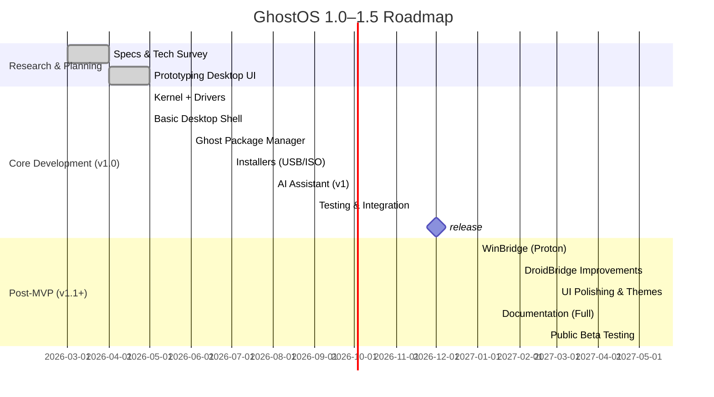

# GhostOS 1.0 — MVP Specification

**Version:** 1.0 (Prototype) **Date:** 2026-06-19

## Executive Summary

GhostOS is an **AI-native, lightweight operating system** designed for **modern UI**, **low-end hardware**, and **universal app support**. Its mission is to let users run **Windows, Linux, Android, and Web apps** seamlessly on one platform. GhostOS 1.0 will be based on the **Linux kernel** (a proven, open-source Unix-like kernel) to leverage mature hardware support and community. Core features include a modern desktop UI, built‑in AI assistant, and a universal package manager. GhostOS will boot from USB (live mode) or install to disk, supporting both legacy BIOS and UEFI with Secure Boot. Applications are sandboxed in containers (using Linux namespaces and cgroups) for security. 

**Key Points:**  
- **Kernel:** Linux (monolithic, open source)  
- **Compatibility Layers:** Wine/Proton for Windows apps; Waydroid for Android apps; native support for Linux apps and PWAs; **no native macOS app support in v1** (planned later).  
- **UI/UX:** Fluent, glassmorphic design; desktop and touch-friendly.  
- **Security:** Application sandboxing (namespaces, seccomp, AppArmor/SELinux policies); signed updates.  
- **Packaging:** New `.ghostpkg` format plus support for `.deb`/`.rpm`/AppImage; built-in *Ghost Store*.  
- **AI:** Local LLM integration (e.g. open models) for assistant and coding tasks.  
- **Boot/Installer:** ISO image with live/installer modes; uses SquashFS (read‑only root) with OverlayFS for persistence; can run entirely from USB (portable mode).  

The MVP focuses on fundamentals and defers complex features (like full macOS app support) to future versions. This document outlines the **MVP scope**, **architecture**, **UI/UX guidelines**, **security model**, **AI features**, **packaging/installer flow**, **development tools/SDK**, **CI/CD plan**, **roadmap**, **team and budget estimates**, and **repo development plan** (issues, structure, CI workflows, etc.).  

## MVP Scope

### Features (GhostOS 1.0)

| **Feature**                     | **Status** | **Notes**                                           |
|---------------------------------|------------|-----------------------------------------------------|
| Windows applications (`.exe`/`.msi`)   | ✅          | Via Wine/Proton compatibility layer |
| Windows games (DirectX, Steam)  | ✅          | DirectX translation (DXVK/VKD3D), Steam (Proton) |
| Linux applications (`.deb`, `.rpm`, AppImage, Flatpak, Snap) | ✅ | Native support; AppImages (uses SquashFS) |
| Android apps (`.apk`, `.aab`)   | ✅          | Via Waydroid container                 |
| Web Apps (Progressive Web Apps) | ✅          | Native support (Chromium Embedded / PWA)            |
| Containers/Docker              | ✅          | Docker/LXC containers, systemd-nspawn                |
| Ghost Native apps (`.ghostpkg`) | ✅          | New format (manifest + binaries + metadata)         |
| CLI tools & scripts            | ✅          | Package via Ghost PKG or native repos               |
| Built‑in AI Assistant         | ✅          | Local LLM (offline) for code, voice, system tasks    |
| Live USB (trial mode)          | ✅          | Bootable USB with live system (SquashFS + overlay) |
| Portable USB install           | ✅          | Entire OS installed on USB (persistent mode)        |
| Full disk install (SSD/HDD)    | ✅          | Standard installer for local drive                  |
| Secure Boot & UEFI/BIOS       | ✅          | GRUB supports both (with signed kernel/modules)     |
| Sandboxed apps & permissions   | ✅          | Namespaces, seccomp, AppArmor/SELinux (optional) |
| Automatic updates (signed)     | ✅          | Incremental OS updates; rollback on failure         |
| Driver management (NVIDIA/AMD/WiFi) | ✅ | Automatic detection and install from repos          |

### Excluded (GhostOS 1.0)

- **Native macOS app support** (`.dmg`/`.app`): *Not included in v1*. macOS binaries rely on Apple frameworks (Cocoa, Metal, etc.) absent on Linux; macOS compatibility is **planned for v2.0+** with a new “MacBridge” layer.  
- **Custom kernel**: Initially using mainline Linux; custom kernel components planned for v3.0.  
- **Enterprise fleet features**: (Central management console, etc.) to come in later versions.  
- **Mobile OS (phone) version**: Focus is desktop x86/x64; ARM64 support for e.g. Raspberry Pi is future work.  

### Sample Feature Comparison

```markdown
Feature              | GhostOS 1.0 (MVP) | GhostOS 2.0+ / Future
-------------------- | ----------------- | -------------------
Windows apps (.exe)  | ✅ via Wine/Proton | ✅ improved compatibility
macOS apps (.dmg/.app) | ❌ (unsupported) | 🔜 MacBridge (v2)
Android apps (.apk)  | ✅ via Waydroid     | ✅ (improved)
Linux apps (.deb/.rpm/AppImage) | ✅ | ✅
Web apps (PWA)       | ✅                 | ✅
AI Assistant         | ✅ (local LLM)      | ✅ (online+agents)
Live USB             | ✅ (SquashFS+Overlay) | ✅
Secure Boot          | ✅ (UEFI support)   | ✅
Custom Kernel        | ❌ (Linux base)     | 🔜 (ghost Kernel in v3)
```

## Technical Architecture

### Kernel and Core OS

GhostOS 1.0 will use the **Linux kernel** as its base. The Linux kernel is a *free, open-source Unix-like kernel*, widely used in PCs, servers, and embedded devices. It supports thousands of hardware devices and architectures out of the box, making it ideal for a lightweight OS on diverse hardware. The initial distribution can be derived from a minimal Linux system (e.g. Alpine, Debian netboot, or a custom build). Key kernel features:

- **Monolithic design:** The entire OS kernel runs in privileged mode, ensuring performance (modern Linux is efficient and modular).  
- **Driver support:** Hundreds of built-in drivers (NVIDIA/AMD GPU, Intel, Wi-Fi, Bluetooth, etc.).  
- **Process scheduler & memory management:** Mature and optimized for desktop responsiveness and low-power devices.  
- **Security Modules:** SELinux/AppArmor enabled for hardening.  
- **Namespaces & cgroups:** Foundational primitives for container isolation (used for app sandboxing).  

We will initially use an unmodified upstream kernel. Future versions may incorporate custom patches (e.g. *ghost kernel components* in GhostOS v3.0).

### Compatibility Layers

GhostOS provides multiple “bridge” layers to run apps from other ecosystems:

- **WinBridge (Windows apps):** Uses [**Wine**](https://www.winehq.org) and Valve’s **Proton** to run Windows executables. Wine is a compatibility layer that translates Windows system calls to POSIX calls; Proton bundles Wine plus additional fixes for gaming. *Example:* Visual Studio Code on GhostOS can run using its Windows installer through Wine. According to WineHQ, *“Wine is a compatibility layer capable of running Windows applications on several POSIX-compliant operating systems”*.  
- **LinuxBridge (Linux apps):** Native support. Debian/Red Hat packages and AppImages run directly. GhostOS can run any Linux application that the kernel and libraries support. AppImage (portable Linux app format) itself uses SquashFS to package apps. We may also support Flatpak/Snap sandboxing.  
- **DroidBridge (Android apps):** Uses [**Waydroid**](https://waydro.id), a Linux container for Android. Waydroid “runs a full Android system in a container” using Linux namespaces. It provides near-native performance and integrates Android windows into the desktop. GhostOS will include an Android runtime (e.g. AOSP 13 base) with Waydroid so users can install APKs.  
- **MacBridge (macOS apps):** *Not in v1.* Native macOS binaries rely on Cocoa, Metal, etc., which Linux lacks. A compatibility layer (like Darling or a new MacBridge) is extremely complex. We will postpone macOS support to GhostOS 2.0+. For now, users can install Linux or Windows versions of cross-platform apps instead.  
- **WebBridge (Web apps):** Progressive Web Apps (PWAs) run in a browser or dedicated container (like Electron/Chromium integration).

Each bridge is implemented as an *abstracted runtime layer*. For example, installing a Windows app will invoke Wine/proton behind the scenes, while installing an Android app uses Waydroid.

### Boot & Storage

GhostOS supports multiple boot and storage modes:

- **Ghost Bootloader:** Uses GRUB2 (or systemd-boot) to handle both BIOS and UEFI. On UEFI, we include signed bootloader (shim) to support Secure Boot.  
- **Boot Flow:** BIOS/UEFI → **Ghost Bootloader** (GRUB) → **Ghost Kernel** + initramfs → **Ghost Desktop Environment**.  

- **Live USB Mode:** GhostOS can run directly from USB without installing. The USB will contain a **SquashFS**-based root image (read-only) and an optional overlay or persistence file. SquashFS is a compressed, read-only filesystem for Linux; it is commonly used for live CDs. We mount SquashFS as the root layer and overlay it with a writable filesystem (OverlayFS) for changes. As Wikipedia notes, *“Squashfs is often combined with a union mount filesystem, such as OverlayFS, to provide a read-write environment for live Linux distributions”*. This gives fast, compressed base system with persistent updates on top.  
- **Persistent USB / Portable Mode:** GhostOS can be **installed entirely on a USB drive**. All OS files, user data, and installed apps reside on the USB (with overlayfs or a second partition). Users can plug this USB into any PC and get their personal GhostOS environment.  
- **Full Disk Install:** Traditional installer (similar to Ubuntu/Arch installers) writes GhostOS to an internal drive. Installer supports automatic partitioning, dual-boot, LUKS encryption, etc.  

- **File System:** By default, GhostOS uses ext4 (or Btrfs) on installed disks for reliability. The live environment uses SquashFS + OverlayFS. We may call our layered filesystem **GhostFS** internally. Snapshots and rollback (via OverlayFS or Btrfs snapshots) are supported for system updates.  

### Package Management

GhostOS introduces a **universal package manager**. Key elements:

- **Ghost Packages (`.ghostpkg`):** A new format for native apps. Each `.ghostpkg` is a compressed archive containing a `manifest.json`, binaries, assets, and a `permissions.json`. It is versioned and signed. The manifest describes dependencies, entry points, and metadata.  
- **Ghost Store:** A central repository of Ghost apps. Users can `ghost install <app>` to fetch from the store (or external sources like GitHub Releases). The store aggregates Windows ports (via Wine recipes), Linux binaries, Android APKs, and web apps, choosing the best one for the platform.  
- **Existing formats:** We will repurpose existing package systems: GhostOS will natively support `.deb`, `.rpm`, Flatpaks, Snaps, and AppImages. The `ghost` CLI can wrap these (e.g. `ghost install vscode` could install the Debian VSCode package).  
- **Container Packages:** Docker images and OCI containers can be run via an integrated container engine (podman/docker).  
- **Auto-update:** The package manager handles updates. All packages and system updates are cryptographically signed.

## UI/UX Design

GhostOS will have a **modern, intuitive interface**. Main elements:

- **Design Style:** A mix of **Glassmorphism** (frosted-glass transparency), Material 3, and Fluent design. Use dynamic blur, smooth animations (up to 120Hz), and adaptive layouts. Follow Google’s Material Design 3 guidelines (color theming, motion, responsive UI) and Microsoft Fluent guidelines for consistency. Both dark and light themes will be available; accent colour (Ghost Cyan™) used for highlights.  
- **Shell/UI:**  
  - **Top Panel:** Global search box, AI assistant widget, notifications tray, quick settings (network, volume, battery), user profile menu.  
  - **Dock (Launcher):** Favorite apps, recent files, system icons (File Manager, Browser, Terminal, Store). Option to auto-hide.  
  - **Virtual Workspaces:** Multiple desktops with swipe gestures and thumbnail overview.  
  - **Widgets/Activities:** Dashboard for weather, calendar, system stats, AI notes.  
  - **Gestures:** Multi-touch support, edge swipes to open overview or notifications.  
- **Consistency:** All system dialogs and apps use a coherent theme. Native apps (GhostUI) use unified widgets.  
- **Example (Mermaid conceptual):**

  ```mermaid
  graph LR
    A[Top Panel] --> B[Search]
    A --> C[AI Assistant]
    A --> D[Notifications]
    A --> E[Quick Settings]
    A --> F[User Menu]
    subgraph Main UI
      B & C & D & E & F
    end
    G[Dock] --> |Launch Apps| H[Applications]
    G --> I[Files]
    G --> J[Browser]
    G --> K[Terminal]
    G --> L[Store]
  ```

## Security Model

Security is paramount. GhostOS follows best practices:

- **Sandboxing:** Each application runs in an isolated container created via Linux namespaces and cgroups. By default, apps cannot see each other or critical system resources. The desktop enforces per-app containers (similar to Android or Flatpak).  
- **Permissions:** A permission manager lets users control app access (files, camera, microphone, location, network, etc.). When an app is installed, it declares needed permissions in its `manifest.json`. At runtime, GhostOS prompts the user to allow/deny (like mobile OS). Permissions are stored and can be toggled later.  
- **Mandatory Access Control:** We ship with a MAC policy (AppArmor by default, SELinux optional) to confine system services and desktops further. Policies limit access to `/sys`, `/proc`, and sensitive kernel interfaces.  
- **Secure Boot & Updates:** The bootloader and kernel are signed to support UEFI Secure Boot. All system updates (kernel, drivers, packages) are signed and verified. The update system is atomic (using rsync or OSTree-like strategy) so a failed update automatically rolls back to the previous snapshot.  
- **Network Security:** Host firewall (nftables/iptables) is enabled by default. GhostOS can run code in sandboxed network namespaces for untrusted applications.  
- **User Separation:** GhostOS uses a standard Linux user model. Multiple users can log in; data is separated. The `ghost` CLI runs with sudo for system tasks.

## AI Integration

GhostOS is **AI-native**. Every copy includes a local AI stack:

- **Local LLMs:** Support for on-device large language models (e.g. LLaMA, Mistral, Dolly 2.0). Users can install a local model (LLM), which runs with hardware acceleration if available. Offline inference is possible for privacy and availability. (For example, Databricks’ Dolly 2.0 is an open-source LLM designed for on-premise use.)  
- **Ghost AI Assistant:** A system assistant “Ghost” is integrated into the shell. It can execute commands (“ghost open settings”, “ghost install vscode”), answer queries, summarise files, and perform automation tasks. The assistant works offline by default (using local model and knowledge base), with optional cloud support.  
- **Voice Interface:** Ghost can also be invoked via voice (wake word “Hey Ghost”). Speech-to-text and text-to-speech run locally.  
- **Coding Assistant:** Integrated into the desktop editor or terminal: “ghost ai write a bash script to parse logs”. Uses the LLM.  
- **Agent System (Future):** v1.0 will have a simple CLI AI assistant. Later versions will support multi-agent workflows (scheduling tasks, chaining actions).

## Packaging, Installer, and USB

### ISO & Live USB

- **GhostOS ISO:** We produce a bootable ISO image (1–2 GB). It contains a SquashFS root and GRUB EFI images.  
- **Live Mode:** Booting the ISO (via GRUB or Ventoy) drops the user into a live GhostOS session. System runs from memory, root is SquashFS, and the home and overlay are in RAM or on USB persistence.  
- **Persistence:** To save changes in live mode, GhostOS sets up an OverlayFS that writes to a “ghostos-data” partition or file. By default, GhostOS creates a small persistent overlay on USB so user settings and installed apps survive reboot. (This works like Ubuntu’s “casper-rw” persistence, but without manual flags.)  
- **Ventoy Support:** The ISO is Ventoy-compatible. Ventoy (open-source USB toolkit) allows simply copying the ISO to a Ventoy USB stick. Users can then boot GhostOS by selecting it from Ventoy’s menu. Ventoy supports persistence plugins if needed.  
- **USB Installer:** Booting the live mode, the user sees an “Install GhostOS” icon. The installer (built on **Calamares** or similar) guides through:
  1. Language/keyboard selection  
  2. Disk selection (target partition/USB) with optional auto-partition  
  3. User account setup  
  4. Installation progress.  

  The installer will configure UEFI/BIOS boot entries and install the GRUB bootloader. It supports encrypted LVM and filesystem encryption.

### Persistent USB Mode

GhostOS offers a **“portable” USB install** option. When installing to USB, you can enable a mode where all user data (home directory, config, Ghost Store, AI models) reside on the USB itself. On any PC, plugging in the USB and selecting it as boot device yields your personal desktop with all your apps and files.  

**Example usage:**  
```bash
ghostos# usb-format /dev/sdb1
ghostos# ghostos-install --target /dev/sdb1 --portable
```
This creates a bootable USB. To boot GhostOS from USB on a new PC, one can also use Ventoy or write it with a tool like `dd` or Rufus.

### Ghost Package Format

The `.ghostpkg` is a simple ZIP/tar format:
```
app.ghostpkg/
├── manifest.json      # app metadata (name, version, exec path, dependencies)
├── binaries/          # executable files for supported archs
├── assets/            # icons, UI files
└── permissions.json   # declared permissions (network, files, etc.)
```
All fields in manifest are documented in `/docs/ghostpkg-spec.md`.

## Developer Tools & SDK

- **Languages:** Core OS components in **Rust** (safety), drivers in C/C++. Desktop UI with **Flutter** (for cross-platform GPU-accelerated UI) or a lightweight toolkit. Ghost apps can be written in Rust, C/C++, Dart (Flutter), or web technologies (HTML/JS with Chromium engine).  
- **GhostSDK/GhostUI:** A lightweight Rust/C++ UI framework for creating native apps with declarative APIs. Example (Rust pseudocode):
  ```rust
  use ghostui::prelude::*;
  
  fn main() {
      let mut win = GhostWindow::new("Sample Ghost App")
          .size(400, 300)
          .build();
      win.show();
      Ghost::run();
  }
  ```
- **Ghost Studio:** Planned IDE with templates for Ghost app development. Includes WYSIWYG layout editor, GhostFS browser, and a live QEMU emulator.  
- **Package Builder:** CLI tool to assemble `.ghostpkg` from source.  
- **Version Control:** Git repositories for source. GhostOS code (bootloader configs, kernel patches, userland scripts) is open-source on GitHub.

## CI/CD and Testing

- **Repository Hosting:** All code and docs on GitHub (`laravelgpt/ghostos`).  
- **CI Pipelines (GitHub Actions):**  
  - **Build ISO:** A workflow on pushes to `main` builds the GhostOS ISO. It checks out code, installs toolchain (gcc, make, etc.), then runs `make iso`. The resulting `ghostos.iso` is uploaded as a build artifact.  
  - **Unit Tests:** Separate jobs run unit tests for Rust components (`cargo test`) and Python/JS tests as needed.  
  - **OS Smoke Tests:** (Optional) Use QEMU on CI to boot the ISO image and run basic startup tests (e.g. ensure kernel boots, login screen appears). This can use `apkovlc/vm-rs` or similar.  
  - **Container Build:** A job to build and publish Docker container images (for Waydroid, Proton SDK, etc.).  
  - **Linting:** Static analysis for Rust (Clippy), C/C++ (cppcheck), YAML lint, etc.  
- **Release Process:** Tagged releases trigger signed ISO builds. Builds are reproducible and archive in GitHub Releases.

## Roadmap and Timeline

A phased development plan over 18–24 months:



**Milestones:**  
- **MVP Release (v1.0):** Core OS + Live USB + Windows/Linux/Android app support + AI assistant (target: Q4 2026).  
- **v1.1:** Add containerised app store, fix bugs, improve performance.  
- **v2.0:** Introduce Mac compatibility layer (MacBridge), cloud sync, enterprise features.  
- **v3.0:** Custom kernel components, full GhostFS, native Ghost apps.

## Team Roles & Hiring (Example)

| Role                     | Responsibilities                             | Quantity (Year 1) |
|--------------------------|----------------------------------------------|-------------------|
| **Project Lead**         | Overall architecture, coordination          | 1                 |
| **Linux Systems Engineer** | Kernel, drivers, bootloader               | 1–2               |
| **Rust Developers**      | Core OS, Ghost package manager, GhostFS      | 2                 |
| **Frontend/UI Engineers**| Desktop shell (Flutter/Web), UX design       | 2                 |
| **Android/Container Engineer** | Waydroid integration, container system| 1                 |
| **AI/ML Engineer**       | LLM integration, assistant functionality     | 1                 |
| **QA/Test Engineer**     | Automated testing, CI/CD                     | 1                 |
| **DevOps Engineer**      | CI/CD pipelines, infra, release automation   | 1                 |
| **UX/UI Designer**       | Mockups, design system, user flows           | 1                 |
| **Documentation**        | Guides, API docs, website                    | 1                 |

Larger teams (10–15) may be needed if schedules accelerate. Subsequent years (2/3) would scale up for features like Cloud, Enterprise, etc.

## Budget Estimate (Example)

| Category          | Year 1 (2026)   | Year 2 (2027)   | Year 3 (2028)   |
|-------------------|-----------------|-----------------|-----------------|
| **Salaries**      | $300,000        | $600,000        | $1,000,000      |
| **Infrastructure**| $50,000         | $75,000         | $100,000        |
| **Hardware**      | $20,000         | $30,000         | $30,000         |
| **Marketing/PR**  | $30,000         | $50,000         | $50,000         |
| **Misc (Legal, etc.)** | $20,000    | $25,000         | $30,000         |
| **Total**         | ~$420,000       | ~$780,000       | ~$1,210,000     |

*Estimates assume a ~10-person team. Open-source contributions and partnerships can offset costs.*

## Project Management (GitHub)

- **Issue Tracking:** Use GitHub Issues for all tasks. Suggested labels: `bug`, `enhancement`, `proposal`, `help wanted`, `priority:high`, `good first issue`, `documentation`.  
- **Milestones:** Reflect roadmap phases (e.g. “v1.0 Release”, “Compatibility Layer”, “AI Assistant”).  
- **Task List (Sample first issues):**  
  1. **Scaffold Repo Structure** – Create directories (`/boot`, `/kernel`, `/desktop`, `/store`, `/docs`, etc.) and placeholder files. *Label: enhancement*  
  2. **Write README & CONTRIBUTING** – Draft comprehensive README (vision, install, usage) and guidelines. *Label: documentation*  
  3. **Build GhostOS ISO** – Set up a basic Linux chroot or distribution build to produce a bootable ISO with custom GRUB. *Label: feature*  
  4. **Implement Ghost CLI** – Prototype `ghost` command (help text, install/uninstall subcommands). *Label: feature*  
  5. **Integrate Wine** – Container or script to install Wine/Proton in GhostOS for running `.exe`. *Label: feature*  
  6. **Integrate Waydroid** – Set up Waydroid container for APK execution. *Label: feature*  
  7. **Desktop Environment Prototype** – Create a simple GTK/Flutter “Hello World” desktop with dock and panel. *Label: enhancement*  
  8. **Permission Manager UI** – UI design for app permissions (wireframe). *Label: design*  
  9. **CI: Build Workflow** – GitHub Action to auto-build ISO and upload artifact. *Label: devops*  
  10. **Testing: Live USB** – Document steps to create a Live USB (e.g. using Ventoy or `dd`) and boot GhostOS. *Label: documentation*  

*(Prioritise tasks that establish core functionality. Mark easy tasks as `good first issue`.)*

## README.md & CONTRIBUTING.md (Outline)

**README.md** should include:  
- **Project Title & Tagline** (e.g. *“GhostOS: One OS, Every App”*).  
- **Vision Statement** – Summarise the unified app/platform goal.  
- **Features** – Highlight MVP features (Windows/Android/Linux app support, AI, live USB).  
- **Getting Started** – Clone instructions, prerequisites (Linux host to build), basic build script (`make iso`).  
  ```bash
  git clone https://github.com/laravelgpt/ghostos.git
  cd ghostos
  make iso    # builds ghostos.iso
  ```
- **Installation** – How to burn ISO or use Ventoy.  
- **Usage Examples** – `ghost install vscode`, `ghost ai ...`.  
- **Directory Structure** – Briefly describe repo folders.  
- **Development** – How to run tests, formatting rules.  
- **Contributing** – Link to CONTRIBUTING.md.  
- **License** – MIT or GPL etc.  
- **Contact** – Maintainer/team contacts, chat rooms.

**CONTRIBUTING.md** should cover:  
- **Workflow** – Fork/Pull Requests, branch naming.  
- **Coding Standards** – Rust style, commit message guidelines.  
- **Issue Guidelines** – Template for bug reports/feature requests.  
- **Commit Hooks/CI** – Require passing tests before merge.  
- **Code of Conduct** – Link to a code of conduct for contributors.

## Repository Structure (Suggested)

```
ghostos/
├── boot/                # Bootloader configs (GRUB scripts, firmware stubs)
│   └── grub.cfg
├── kernel/              # Kernel build or patches (if any)
│   └── (upstream or custom)
├── rootfs/              # Root filesystem (SquashFS image sources)
│   ├── etc/
│   ├── usr/
│   └── (other Linux filesystem hierarchy)
├── desktop/             # Desktop shell/UI source (Flutter or C++)
│   └── src/
├── store/               # Ghost Store frontend/backend
│   └── (list of app recipes/manifest)
├── packages/           # Custom package build scripts
│   └── (e.g. ghostpkg builder)
├── sdk/                # Ghost SDK & sample apps
│   └── samples/
├── docs/               # Design docs and specifications (MVP spec, Ghostpkg format)
│   ├── ghostos-spec.md
│   ├── ghostpkg-spec.md
│   └── ...
├── .github/            # GitHub Actions workflows, issue templates
│   ├── workflows/
│   │   ├── build.yml
│   │   └── test.yml
│   └── ISSUE_TEMPLATE/
├── Makefile            # Commands: make iso, make install, etc.
├── README.md
└── CONTRIBUTING.md
```

Add sample files as needed. If any code already exists (unspecified), migrate it into the appropriate folder (e.g. kernel patches into `/kernel`, UI code into `/desktop`).

## GitHub Actions (Sample Workflows)

- **Build ISO (`.github/workflows/build.yml`):**

    ```yaml
    name: Build GhostOS ISO
    on:
      push:
        branches: [ main ]
      pull_request:
        branches: [ main ]
    jobs:
      build-iso:
        runs-on: ubuntu-latest
        steps:
          - uses: actions/checkout@v3
          - name: Install Dependencies
            run: |
              sudo apt-get update
              sudo apt-get install -y qemu-utils xorriso grub-pc-bin
          - name: Build ISO
            run: make iso
          - name: Archive ISO
            uses: actions/upload-artifact@v3
            with:
              name: ghostos.iso
              path: output/ghostos.iso
    ```

- **Test (`.github/workflows/test.yml`):**

    ```yaml
    name: CI Test
    on: [push, pull_request]
    jobs:
      lint:
        runs-on: ubuntu-latest
        steps:
          - uses: actions/checkout@v3
          - name: Rust Lint
            run: cargo clippy --all -- -D warnings
          - name: Rust Test
            run: cargo test --all
      integration:
        runs-on: ubuntu-latest
        needs: [lint]
        steps:
          - uses: actions/checkout@v3
          - name: Boot ISO in QEMU (smoke test)
            run: |
              qemu-system-x86_64 -m 2048 -no-reboot -serial none -parallel none \
                -drive file=output/ghostos.iso,format=raw,if=virtio \
                -monitor none -display none &
              sleep 30
              # (Add commands to check QEMU status or logs)
              kill $!
    ```

(*These are illustrative; adjust for actual build tools and test frameworks.*)

## Migration Notes

- **Existing Code:** The current state of the repo is unspecified. If there is starter code or assets, review it and place into this structure. For example, move boot scripts into `boot/`, any UI code into `desktop/`, etc. Delete placeholders if replaced.  
- **Big Breakpoints:** Be prepared to overhaul the repo layout. List any files on `main` that need merging.  

## Usage Commands (Examples)

- Clone the repo and build ISO:
  ```bash
  git clone https://github.com/laravelgpt/ghostos.git
  cd ghostos
  make iso
  ```
- **Creating a bootable USB:**  
  1. **With Ventoy:** Install Ventoy on the USB, then copy `ghostos.iso` onto it.  
  2. **With `dd` (legacy):**  
     ```bash
     sudo dd if=output/ghostos.iso of=/dev/sdX bs=4M status=progress && sync
     ```  
     (Replace `/dev/sdX` with USB device. This method works but will erase the USB.)  
- **Boot parameters:** During live boot, you can append boot options for persistence or debug:
  - `live persistence` (GhostOS can detect and use an attached persistent overlay file).  
  - `acpi=off` or `nomodeset` for hardware compatibility if needed.

---

This specification serves as a **blueprint for GhostOS 1.0 MVP**. It outlines concrete tasks and structure for implementation. Contributors should create issues and PRs based on the above roadmap and task list. The goal is to have a **working prototype (GhostOS 1.0)** by late 2026, demonstrating universal app support, AI assistant, and smooth user experience on low-end hardware.

**Sources:** GhostOS plans leverage existing technologies: Linux kernel, Wine/Proton, Waydroid, Ventoy, SquashFS/OverlayFS, Linux container/security primitives. These inform our architecture and feasibility.
